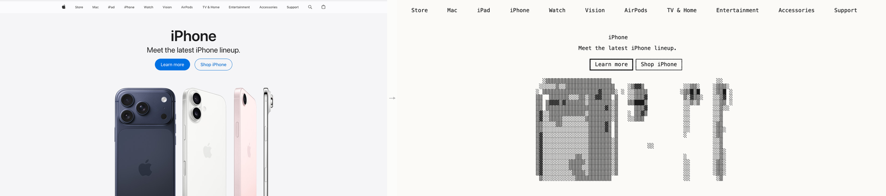
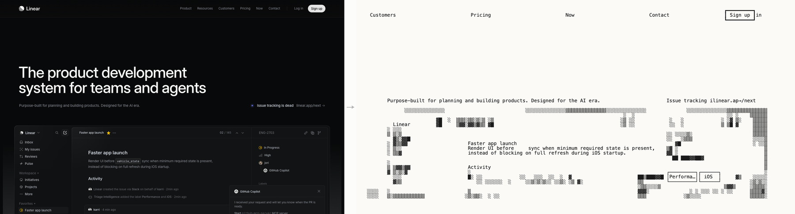
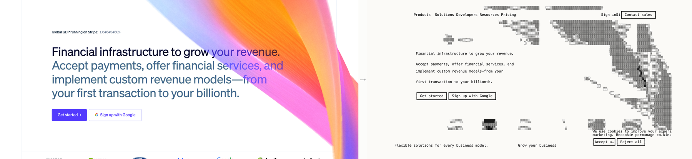
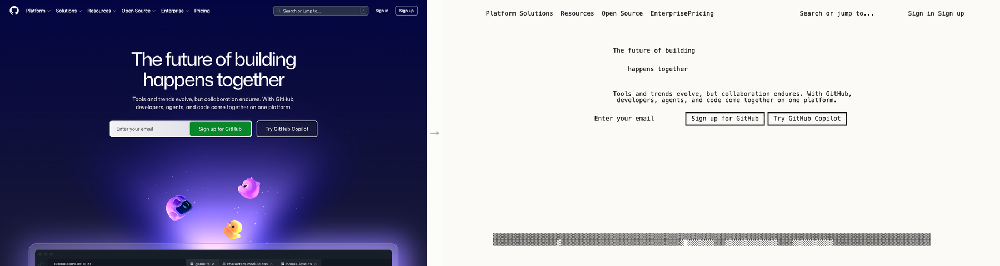

# lofi-ascii

A tiny, fast CLI + Claude skill for turning **images and webpages into ASCII art** — built for design engineers who want quick lofi wireframes, ASCII references, and screenshot mockups they can paste anywhere markdown renders.

<p align="center"></p>

<p align="center"><sub>One command. The whole page → ASCII.</sub></p>

```bash
lofi-ascii url https://www.apple.com --width=140
```

```
┌──────────────────────────────────────────────────────────────────────────────┐
│  [ Logo ]    Product   Pricing   Docs   Blog          [ Sign in ]  [ Start ] │
└──────────────────────────────────────────────────────────────────────────────┘

                       ┌─────────────────────────────────┐
                       │   Build faster, ship smarter    │
                       │                                 │
                       │   ┏━━━━━━━━━━━━━┓  ┌────────────┐│
                       │   ┃ Get started ┃  │ Learn more ││
                       │   ┗━━━━━━━━━━━━━┛  └────────────┘│
                       └─────────────────────────────────┘
```

## What it does

- **`url`** — **text-aware webpage → ASCII** (default). Real text from the DOM stays as readable text. Images (`<picture>`, ``, `<video>`, `<svg>`) get pixel-rendered as ASCII via [`chafa`](https://hpjansson.org/chafa/) and composited back at the right positions. Headings, buttons, nav copy stay legible — only the photographs become art.
- **`url-image`** — webpage screenshot → ASCII with the native renderer. This is the clean Asciinator-style path: the whole page becomes character art, including text, with no `chafa` or Pillow dependency.
- **`url-pixel`** — legacy mode. Whole page through chafa. Useful when you specifically want a pixel-style render of the entire page (no DOM parsing).
- **`render`** — image file → ASCII (Unicode blocks, braille, pure ASCII, color photo, edge sketch). Deterministic, fast.
- **`wireframe`** (via Claude skill) — *Claude* looks at the image and emits a structured, labeled ASCII wireframe with box-drawing characters. Best for UI work because it understands "this is a button" and labels it accordingly.
- **`gallery`** — render one input in every style for quick comparison.
- **`compare`** — two inputs side-by-side (or stacked). Great for A/B previews or before/after.
- **`to-png`** — render an ASCII file back to a PNG, perfect for embedding in Figma, design docs, READMEs.
- **`components`** — a library of pre-made ASCII components (navbar, hero, pricing, signup form, modal, data table, etc.).

## Install

**Quickest — run it with `npx` (no install):**

```bash
npx lofi-ascii url https://stripe.com --width=120
```

**Install globally:**

```bash
npm install -g lofi-ascii
lofi-ascii doctor
```

`npm` brings `puppeteer-core` (for the text-aware `url` mode) automatically. For the
local image modes you still want **chafa** (`brew install chafa`) and **Chrome** for
screenshots — `lofi-ascii doctor` tells you exactly what's missing.

**Install from source (also wires up the Claude skill):**

```bash
git clone https://github.com/KishParikh13/lofi-ascii ~/Code/lofi-ascii
bash ~/Code/lofi-ascii/scripts/install.sh
```

The source installer:
- Installs `chafa` via Homebrew if missing (local image/gallery/photo modes)
- Verifies Chrome is installed (or Chromium)
- Installs `puppeteer-core` for the text-aware `url` mode
- Symlinks `lofi-ascii` into `~/.local/bin`
- Symlinks the skill into `~/.claude/skills/lofi-ascii` so Claude Code picks it up

Then:
```bash
lofi-ascii doctor                                # check deps
lofi-ascii url https://stripe.com --width=120    # try it
```

## Usage

```bash
# Convert an image
lofi-ascii render hero.png --style=blocks --width=80
lofi-ascii render hero.png --style=braille --width=60    # max density
lofi-ascii render hero.png --style=lofi    --width=60    # pure 7-bit ASCII

# Convert a webpage (auto-screenshots first)
lofi-ascii url https://stripe.com --style=blocks
lofi-ascii url-image https://stripe.com --style=detailed --width=140
lofi-ascii url https://stripe.com --mobile               # 390px viewport
lofi-ascii url https://stripe.com --desktop --full-page  # 1440px, full scroll

# Just save the screenshot (no ASCII)
lofi-ascii screenshot https://example.com --out=example.png

# See every style at once
lofi-ascii gallery https://stripe.com --width=60

# Side-by-side comparison
lofi-ascii compare https://stripe.com https://square.com --width=50
lofi-ascii compare a.png b.png --stack                   # stacked instead

# ASCII → PNG (great for Figma/docs)
lofi-ascii to-png wireframe.txt --out=wireframe.png --font-size=14

# Component library
lofi-ascii components                                    # list all
lofi-ascii components signup-form                        # print one
```

### Styles

| Style | Output | Best for |
|---|---|---|
| `blocks` (default) | Unicode block + box-drawing, monochrome | UI screenshots, general-purpose |
| `braille` | Braille dots, max density | Showing fine UI structure |
| `lofi` | Pure 7-bit ASCII | Copy-paste anywhere safe |
| `sketch` | Edge-emphasized | Outline-style wireframes |
| `photo` | 256-color half-blocks + dithering | Terminal-only photo rendering |

### Options

| Flag | Default | Notes |
|---|---|---|
| `--style=NAME` | `blocks` | One of the above |
| `--width=N` | `80` | Output width in chars (max 240) |
| `--theme=light\|dark` | `light` | Inverts polarity for dark terminals |
| `--high-contrast` | off | Threshold-binarize the source first (legacy `url-pixel` flag). The default text-aware `url` mode no longer needs this — its tile-based renderer handles mixed-contrast subjects (dark + white + pink iPhones on one canvas) automatically. |
| `--threshold=N` | `235` | Cutoff for `--high-contrast` (0-255). Higher catches more subtle elements. |
| `--preprocess=MODE` | `none` | `threshold`, `contrast`, or `edges`. `--high-contrast` is a shorthand for `--preprocess=threshold`. |
| `--charset=CHARS` | style ramp | Native renderer custom character ramp, ordered darkest to lightest. |
| `--density-bias=N` | `1.0` | Native renderer tone curve. Higher values use lighter characters for more of the image. |
| `--height-scale=N` | `1.0` | Native renderer row multiplier. Useful if a font renders too squat or too tall. |
| `--brightness=N` | `8` | Native renderer brightness adjustment, roughly `-100..100`. |
| `--contrast=N` | `22` | Native renderer contrast adjustment, roughly `-100..100`. |
| `--gamma=N` | `1.0` | Native renderer gamma adjustment. |
| `--pixelate=N` | `0` | Native renderer source pixel block size for chunkier output. |
| `--sample-mode=NAME` | `detail` | Native renderer sampling strategy: `average`, `detail`, `ink`, or `edges`. |
| `--detail-weight=N` | `0.2` | Detail-mode blend weight. Lower values preserve small text/borders more aggressively. |
| `--mobile` / `--desktop` | desktop | Browser viewport for URL mode |
| `--full-page` | off | Capture full scrollable page |
| `--wait=MS` | `1500` | Wait before screenshot |
| `--out=PATH` | auto-named | Override save path |
| `--no-save` | off | Print only, skip file write |
| `--stack` | side-by-side | `compare` orientation |
| `--font-size=N` | `14` | `to-png` text size |

## Using the Claude skill

Once installed, just talk to Claude:

> "Make an ASCII wireframe of stripe.com"
> "Convert ~/Desktop/figma-export.png to lofi ASCII"
> "Compare these two URLs side by side as ASCII"

Claude picks the right mode automatically: **wireframe mode** (Claude visually inspects the image and emits a labeled, structured wireframe with semantic regions) for semantic UI work, **url-image mode** for fast screenshot-to-ASCII webpage captures, and **render mode** (deterministic chafa) for photos and assets.

The skill ships with a component library (`navbar`, `hero`, `pricing-table`, `signup-form`, `data-table`, `modal`, `mobile-nav`, etc.) Claude can stitch together when you describe a UI from scratch instead of providing a source image.

## How the apple.com hero is made

The `assets/comparison.png` banner is the output of:

```bash
lofi-ascii url https://www.apple.com --width=140
lofi-ascii to-png ./ascii-www-apple-com-*.txt --out=hero.png
```

What's happening:

1. **Headless Chrome** opens apple.com and runs JS that walks the DOM. It collects every visible text node (rect, font-size, content), every button-like element (`<button>`, anchors styled as buttons), every nav link, and every image-bearing element (`<picture>`, ``, `<svg>`, `<video>`).
2. The same Chrome session saves a screenshot.
3. **The Python compositor** builds a character grid sized to your `--width`. For each image region, it crops the screenshot and renders it as a **wireframe-style ASCII**: per-tile histogram-stretched foreground mask combined with edge-detection. The result preserves *shape and structure* (silhouettes, bezels, camera bumps) without trying to be a faithful pixel render. Then it overlays:
   - **Body text** (headings, paragraphs) — written as real characters
   - **Buttons** — drawn as ASCII boxes (`┏━━┓ ┃ Learn more ┃ ┗━━┛` for filled, `┌──┐ │ Buy │ └──┘` for outline)
   - **Nav row** — laid out at the top with the actual nav text
4. Result: an ASCII page that you can actually *read*. "iPhone" is still "iPhone". "Learn more" is still a button labeled "Learn more". Only the iPhone product photos become art.

**Why wireframe-style instead of pixel-faithful?** A near-black iPhone on a light page would collapse to a solid `█` blob under naive brightness mapping — every pixel maxes out. Designers reading the ASCII don't need photo accuracy; they need *shape*. Per-tile normalization plus edges gives every subject (dark Pro, white iPhone, pink Air, side-profile iPhone) its own dynamic range, so each phone is recognizable.

## More examples

Each of these is a real side-by-side from `lofi-ascii url <url> --width=140`: source screenshot on the left, ASCII output on the right.

### linear.app

<p align="center"></p>

The Linear product screenshot becomes a recognizable dashboard wireframe: the sidebar, the active issue row, the activity feed, and the labelled "Performance / iOS" pills all survive.

### stripe.com

<p align="center"></p>

Stripe's colorful animated payments illustration is a 1392-wide `<picture>` element that overflows the viewport. The compositor clips it to the visible region and renders the gradient as a wireframe contour — preserving the *shape* of the flowing strokes alongside the readable headline and CTAs.

### github.com

<p align="center"></p>

GitHub's hero is text + an inline `<video>` that lives mostly below the fold — only a thin strip is visible in the viewport, which the renderer correctly shows as a slim wireframe band at the bottom.

> **Width tip:** `--width=140` is the sweet spot for desktop sites. Drop to `--width=100` for narrower contexts (it'll truncate longer button labels with `…`). The floor is 60.

### Stitched from the component library

`lofi-ascii components` ships pre-made ASCII blocks you can drop into READMEs, design docs, or feed to Claude as a wireframe scaffold:

```bash
lofi-ascii components signup-form
```

```
              ┌─────────────────────────────────────────┐
              │  Create your account                    │
              │                                         │
              │  ┌─────────────────────────────────────┐│
              │  │ Email                               ││
              │  │ you@example.com                     ││
              │  └─────────────────────────────────────┘│
              │                                         │
              │  ┌─────────────────────────────────────┐│
              │  │ Password                            ││
              │  │ ••••••••                            ││
              │  └─────────────────────────────────────┘│
              │                                         │
              │  ▢ I agree to Terms and Privacy         │
              │                                         │
              │  ┏━━━━━━━━━━━━━━━━━━━━━━━━━━━━━━━━━━━━━┓│
              │  ┃         Create account              ┃│
              │  ┗━━━━━━━━━━━━━━━━━━━━━━━━━━━━━━━━━━━━━┛│
              └─────────────────────────────────────────┘
```

```bash
lofi-ascii components pricing-table
```

```
  ─── Pricing ─────────────────────────────────────────────────────────────────

  ┌──────────────┐  ┏━━━━━━━━━━━━━━┓  ┌──────────────┐
  │ Free         │  ┃ Pro          ┃  │ Enterprise   │
  │              │  ┃ ★ Most pop.  ┃  │              │
  │ $0 / mo      │  ┃ $29 / mo     ┃  │ Custom       │
  │              │  ┃              ┃  │              │
  │ ◯ Feature    │  ┃ ● Feature    ┃  │ ● Feature    │
  │ ◯ Feature    │  ┃ ● Feature    ┃  │ ● Feature    │
  │ ◯ Feature    │  ┃ ● Feature    ┃  │ ● SSO + SLA  │
  │              │  ┃              ┃  │              │
  │ [  Start  ]  │  ┃ [  Choose  ] ┃  │ [ Contact  ] │
  └──────────────┘  ┗━━━━━━━━━━━━━━┛  └──────────────┘
```

Run `lofi-ascii components` to see the full list — `navbar`, `hero`, `cta-banner`, `feature-grid`, `data-table`, `modal`, `mobile-nav`, `notifications`, `card`, `footer`, `form-fields`.

### Local image → ASCII (`render`)

```bash
lofi-ascii render hero.png --style=blocks --width=80     # Unicode blocks
lofi-ascii render hero.png --style=braille --width=60    # max density
lofi-ascii render hero.png --style=lofi    --width=60    # pure 7-bit ASCII
lofi-ascii render hero.png --style=sketch  --width=80    # edge-emphasized
```

### Side-by-side comparisons

```bash
lofi-ascii compare https://stripe.com https://square.com --width=60
lofi-ascii compare before.png after.png --stack
```

### ASCII back to PNG

For Figma, design docs, or anywhere PNG is the destination:

```bash
lofi-ascii to-png wireframe.txt --out=wireframe.png --font-size=14
```

## Why "lofi"?

Because ASCII is the design tool you reach for when you don't want to think about pixels yet. Native screenshot renders and chafa output capture *layout and density* without committing to anything. They paste cleanly into:

- Claude conversations (the whole reason this exists)
- GitHub issues, PR descriptions, README files
- Linear tickets, Notion docs
- Email and Slack (monospace-safe)
- Comments inside source code

No file format. No screenshot tool. Just text.

## Dependencies

- **Native renderer** — dependency-free PNG screenshot → ASCII path used by `url-image`.
- **`chafa`** — image-to-ASCII engine for `render`, `gallery`, and legacy pixel modes. `brew install chafa`.
- **Google Chrome** (or Chromium) — used for `url` and `screenshot` modes. The installer detects it.
- **Python 3** + **Pillow** — used by the text-aware compositor and `to-png` size calculations. Ships with macOS; Pillow installed by `scripts/install.sh`.
- **Node + puppeteer-core** — used by the text-aware mode to drive headless Chrome with DOM extraction. Installed by `scripts/install.sh`. Falls back gracefully (uses pixel-only rendering) if Node is missing.

## Project layout

```
~/Code/lofi-ascii/
├── bin/lofi-ascii          # main CLI (the only entrypoint)
├── lib/                    # sourced modules
│   ├── styles.sh           # chafa flag presets per style
│   ├── render.sh           # image → ASCII (chafa)
│   ├── native.sh           # PNG screenshot → ASCII wrapper
│   ├── native_render.py    # dependency-free PNG decoder + ASCII renderer
│   ├── screenshot.sh       # URL → PNG (headless Chrome)
│   ├── text_aware.sh       # url mode wrapper (extract + composite)
│   ├── composite.py        # the compositor — DOM + screenshot → ASCII grid
│   ├── compare.sh          # side-by-side / stacked output
│   ├── gallery.sh          # all styles for one input
│   ├── to_png.sh           # ASCII → PNG (Chrome rendering)
│   └── output.sh           # save policy + slug generation
├── node/
│   ├── extract.js          # puppeteer DOM walker (text/buttons/nav/images)
│   └── package.json        # puppeteer-core dep
├── examples/               # canonical output + reference wireframes
├── components/             # composable ASCII UI components
├── scripts/install.sh      # idempotent setup
├── SKILL.md                # Claude-facing instructions
└── README.md               # you are here
```

## Credits

Built with [chafa](https://hpjansson.org/chafa/) (Hans Petter Jansson) for local image rendering, plus a dependency-free native screenshot renderer for webpage captures. Inspired by [neethanwu/ascii-art](https://github.com/neethanwu/ascii-art), [trabian/fluxwing-skills](https://github.com/trabian/fluxwing-skills), and modern browser ASCII studios such as ASCIInator and Glyphcast.

## License

MIT. See [LICENSE](./LICENSE).
